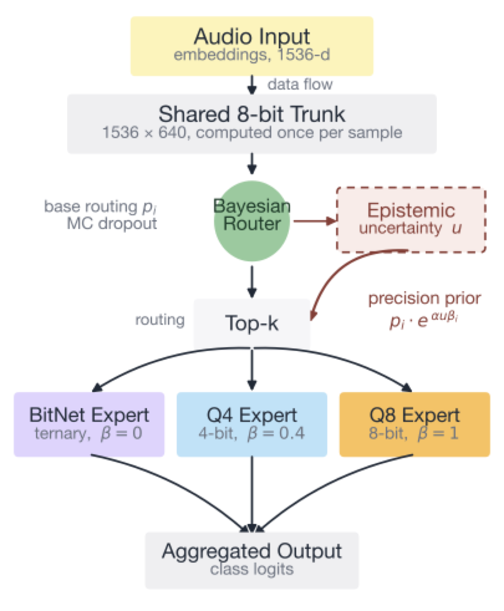

[](https://arxiv.org/abs/2511.11743)
[](LICENSE)
[](https://github.com/sebasmos/curious-qmoe)

# curious-qmoe

**Quantized audio models are fast but erratic. This makes them predictable.**

Shrink an audio classifier to 4 bits and it keeps 99.9% of its accuracy. Run it
five times and the accuracy moves around. On an edge device that variability is
the problem: you cannot promise a latency budget you cannot predict.

`curious-qmoe` routes each input to a quantized expert based on how uncertain
the model is about it. Confident inputs stay on the cheap low-bit expert.
Uncertain ones go to a higher-precision one. **Cross-fold variance drops by 68
to 97%.**

<p align="center">
  
</p>

```python
import torch
from omegaconf import OmegaConf
from QWave.moe import qMoEModelBatched

cfg = OmegaConf.load("config/esc50.yaml")
r = cfg.experiment.router
r.use_curiosity = True                     # uncertainty-aware routing
r.shared_trunk = True                      # one shared trunk, half the parameters
r.expert_quantizations = ["bitnet", 4, 8]
r.num_experts = 3

model = qMoEModelBatched(cfg, in_dim=1536, num_classes=5, num_experts=3, top_k=1)
logits, routing_probs, lb_loss, uncertainty = model(torch.randn(8, 1536))
```

## Results

| | |
|---|---|
| Stability | 68 to 97% lower cross-fold variance than uniform routing |
| Accuracy | +1.6 F1 on ESC-50 super-categories, replicated over two runs |
| Size | 1.82M parameters, down from 3.80M, by sharing one quantized trunk |
| Precision | BitNet ternary, BitLinear 1 to 16 bit, post-training quantization |

**The honest part:** a single 4-bit model is still faster and more accurate than
any mixture we measured. We report that rather than bury it. Use this when
predictability matters more than raw speed.

## Install

```bash
conda create -n curious-qmoe python=3.11 -y && conda activate curious-qmoe
git clone https://github.com/sebasmos/curious-qmoe.git && cd curious-qmoe
pip install -e .
```

## How it works

The router estimates epistemic uncertainty with Monte Carlo dropout, then
reweights its routing distribution toward higher-precision experts in
proportion to it:

$$p_i^{\text{UA}} \propto p_i \cdot \exp(\alpha \, u \, \beta_i)$$

where $u$ is the sample's uncertainty and $\beta_i$ is expert $i$'s normalized
precision. When the model is confident, $u \to 0$ and routing is unchanged.
When it is not, mass shifts toward the experts that can afford to be right.

This produces *polarization*: a trained router sends 83 to 92% of samples to one
dominant expert, removing the cost-mode switching that makes mixture latency
jump around.

## Reproducing the paper

Every number in the paper regenerates from this repository. Setup, the full run
matrix, and the claim-to-command map are in **[CONTRIBUTING.md](CONTRIBUTING.md)**.

```bash
bash scripts/reproduce_paper.sh          # every run behind the tables
python scripts/collect_paper_numbers.py  # tables and significance tests
```

## Citing

```bibtex
@article{cajas2026uncertainty,
  title   = {Uncertainty-Aware Routing Makes Quantized Mixture-of-Experts Stable},
  author  = {Cajas Ordo{\~n}ez, Sebastian Andres and others},
  journal = {arXiv preprint arXiv:2511.11743},
  year    = {2026}
}
```

MIT licensed.
